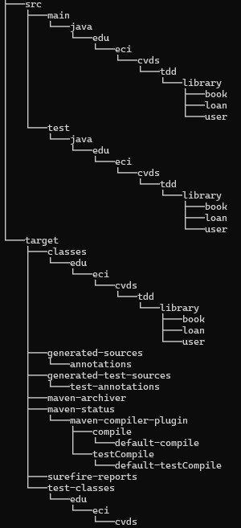
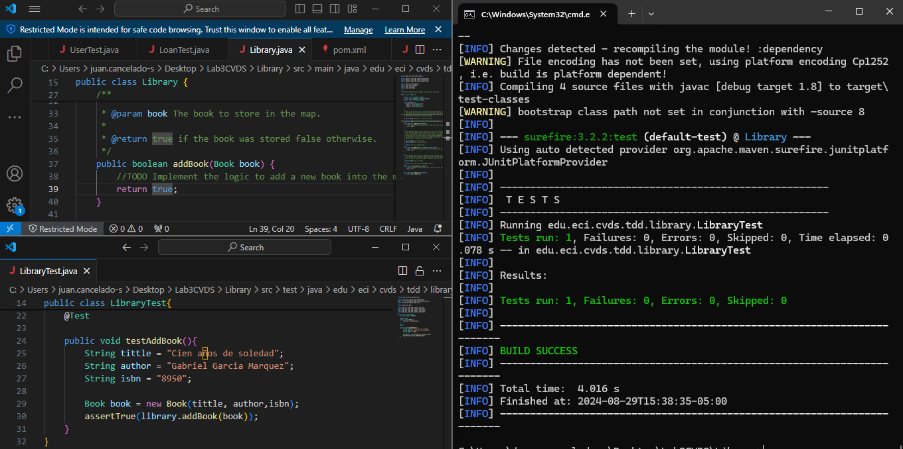
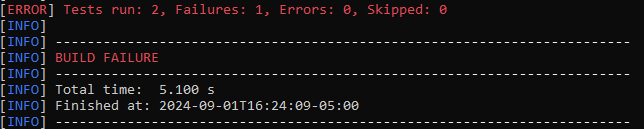
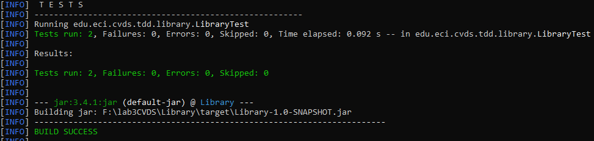

Integrantes: 
Juan Esteban Cancelado Sanchéz
Nicolás Prieto Vargas

Se agregaron las carpetas library, book, loan y user tanto a la carpeta principal como a la carpeta de test.

Se hizo la prueba de addBook y se modificó de la mínima manera para que pase la prueba.

Se creó la prueba de crear agregar dos libros con el mismo isbn y no pasó.

Ahora se  modifica el método para que esa prueba pase de tal manera que no se puedan crear dos libros con el mismo isbn.

