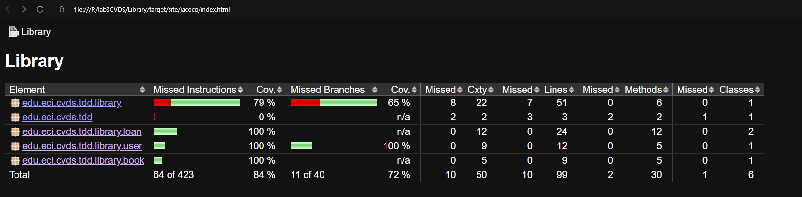

# Proyecto de Pruebas de Biblioteca

## Integrantes

- **Juan Esteban Cancelado Sánchez**
- **Nicolás Prieto Vargas**

## Estructura del Proyecto

Se han creado las siguientes carpetas en la estructura del proyecto:

- `library`
- `book`
- `loan`
- `user`

Estas carpetas están presentes tanto en la carpeta principal como en la de pruebas (`test`).

## Pruebas y Modificaciones

### Prueba de `addBook`

Se implementó la prueba inicial para el método `addBook`, y se realizó una mínima modificación para que la prueba pasara satisfactoriamente.

### Prueba para Libros con el Mismo ISBN

Se creó una prueba para verificar que no se puedan agregar dos libros con el mismo ISBN. Esta prueba inicialmente falló.

Se modificó el método `addBook` para asegurar que no se puedan crear dos libros con el mismo ISBN.

### Prueba de Creación de Libros con Diferente ISBN

Se verificó que es posible agregar múltiples libros con ISBN diferentes sin problemas.

### Prueba de Adición de Usuarios

Se implementó una prueba para agregar usuarios al sistema correctamente.

### Integración de Jacoco

Se añadió el código necesario en el archivo `pom.xml` para generar un informe de cobertura del código utilizando Jacoco.

### Resultados Finales

Finalmente, se logró una cobertura de código superior al 80%, con el sistema funcionando correctamente.

